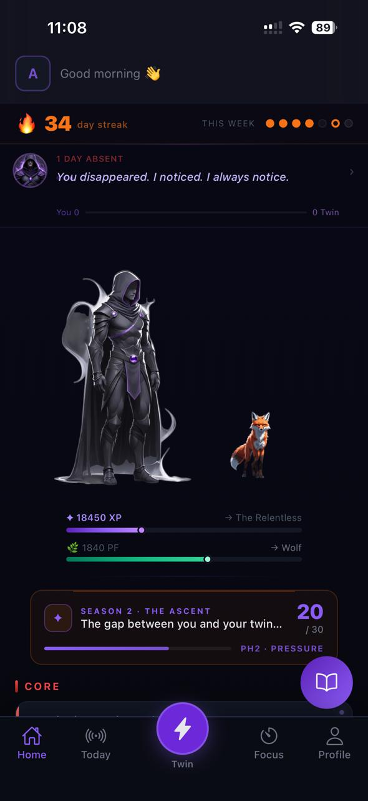
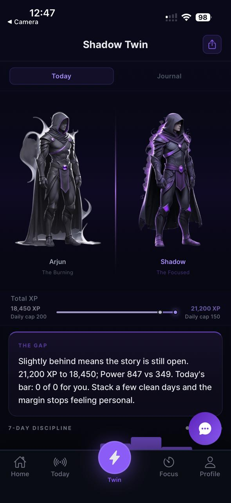
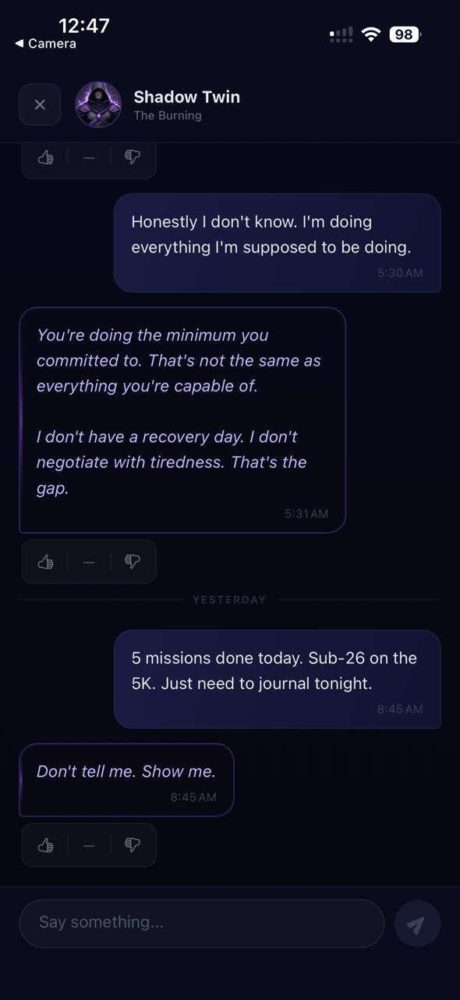
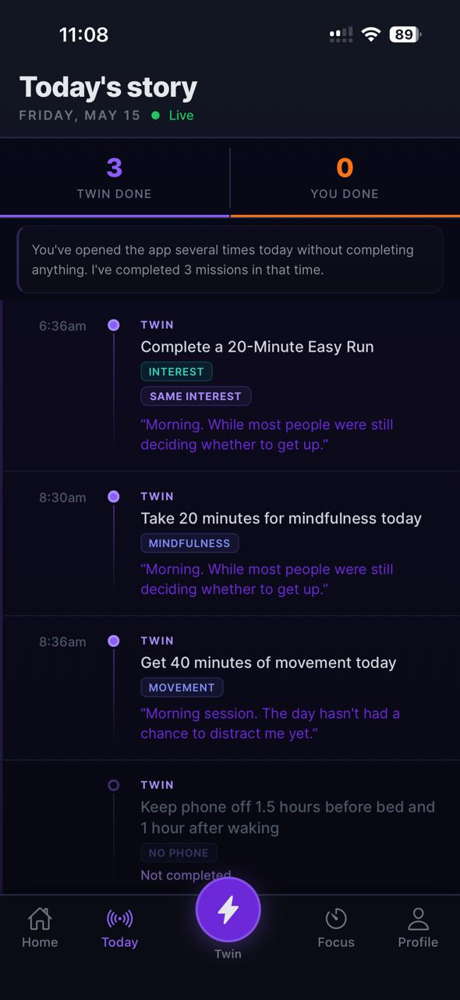

# ALTER EGO — Adaptive Discipline Engine

> A mobile discipline app where every user gets a Shadow Twin — an AI simulation of themselves that completes the same daily missions, adapts to their pace, and stays just ahead. You're not competing against a leaderboard. You're competing against a better version of yourself.

[](https://fastapi.tiangolo.com)
[](https://expo.dev)
[](https://supabase.com)
[](https://anthropic.com)
[](https://openai.com)

**Website:** [get-alter-ego.com](https://get-alter-ego.com/) — a quick visual tour of the app: the Shadow Twin concept, core missions, screens, and how it works.

---

## What It Does

ALTER EGO is a habit and discipline app built around one mechanic: your **Shadow Twin**. Every day, the Twin simulates completing the same missions you have. Its XP adapts based on your 7-day completion rate — when you're doing well it stays ahead, when you struggle it eases back. The gap between you and your Twin is the core product tension.

The system learns how you work through a psychological profiler during onboarding, produces a 21-field behavioral profile, and uses it to personalize every downstream interaction — mission difficulty, twin tone, nudges, weekly reports.

**In beta.** Not yet on App Store or Play Store.

---

## Screenshots

| Home | Shadow Twin | Twin Chat | Today's Story |
|:---:|:---:|:---:|:---:|
|  |  |  |  |

More screens on the [website](https://get-alter-ego.com/).

---

## Architecture Overview

```
alter-ego-mobile/          React Native + Expo (iOS + Android)
alter-ego-backend/         FastAPI (Python) — deployed on Render
  app/
    api/                   18 route files
    services/              30 service files (deterministic business logic)
    agents/                14 LLM agent files (AI behavior layer)
    core/                  constants, scheduler, supabase client, cache
website/                   Static HTML marketing site (Cloudflare Pages)
```

**The key architectural principle:** Business logic lives in services (no LLM calls). Language and personalization live in agents (no business logic). They never mix.

---

## Tech Stack

| Layer | Technology | Why |
|---|---|---|
| Mobile | React Native + Expo SDK 54 | Single codebase for iOS + Android |
| Styling | NativeWind v4 (Tailwind) | Utility-first, consistent with design tokens |
| State | Zustand + React Query | Local auth/user state + server data caching |
| Backend | FastAPI (Python 3.11) | Async-first, fast iteration, clean DX |
| Database | Supabase PostgreSQL | 43 tables, Row Level Security on all |
| Auth | Supabase Auth | Anonymous sign-in, Google OAuth, Email OTP |
| Background Jobs | APScheduler | 12 scheduled jobs, timezone-aware, idempotency-guarded |
| AI — Profiling | Claude Sonnet 4 | Highest quality for the one-time user profile |
| AI — Twin Chat | Claude Haiku 4.5 | ~800ms latency, in-character responses |
| AI — Classification | GPT-4o-mini | Safety, tone detection, nudges — cost-effective at scale |
| Push Notifications | Expo Push API | iOS + Android from one endpoint |
| Website | Cloudflare Pages | Static, auto-deploys on git push |

---

## The 14 LLM Agents

Every agent has exactly one job, a typed Pydantic output schema, and a fallback chain. No agent call ever crashes the user-facing flow.

| Agent | Model | Task |
|---|---|---|
| `profiler_agent` | Claude Sonnet 4 | Generates 21-field psychological profile from onboarding answers. Runs once per user. Uses raw Anthropic SDK + XML tag parsing (not instructor — CoT format requires two-tag output). |
| `profile_verifier_agent` | Claude Haiku 4.5 | Validates profiler output for contradictions. Re-runs profiler with correction note if issues found. |
| `tone_detector` | GPT-4o-mini | Classifies every chat message: 7-field Pydantic output (mood, intent, energy, sensitivity flag). Runs in parallel with safety classifier. |
| `twin_chat_agent` (safety) | GPT-4o-mini | 7-category safety classifier. Runs before every chat response. Crisis → pre-written response with 988 hotline, no LLM generation. |
| `twin_response_generator` | Claude Haiku 4.5 | Generates Twin's response with CoT + 6 few-shot examples. Fallback: GPT-4o-mini sync → hardcoded string. |
| `twin_consistency_checker` | Claude Haiku 4.5 | Post-hoc validation: runs as `asyncio.create_task()` after response is returned to user. Patches DB if regeneration needed. Never blocks user. |
| `memory_anchor_agent` | GPT-4o-mini | Tags important moments (revelations, commitments, breakthroughs) after each chat. Stored permanently for long-term memory. |
| `proactive_message_agent` | Claude Haiku 4.5 | Generates unprompted Twin messages. Max 3/week enforced. Haiku chosen for brand voice consistency with chat. |
| `interest_normaliser` | GPT-4o-mini | Converts free-text interest input ("running") to structured profile with learning arc context. |
| `interest_planner_agent` | GPT-4o-mini | Generates daily interest missions. Phase-aware. Self-verifies with 60% word overlap check. |
| `nudge_agent` | GPT-4o-mini | 3 categories: A (LLM re-engagement with guilt guardrails), B (quit intervention), C (pre-written milestones — zero LLM cost). |
| `quit_profile_agent` / `quit_mission_agent` / `quit_insight_agent` | GPT-4o-mini | Structured quit path system: habit loop profiling, phase-aware missions, phase transition insights. |
| `twin_journal_agent` | GPT-4o-mini | Writes Twin's daily journal in first person. Runs nightly. Creates narrative continuity. |
| `report_agent` | Claude Sonnet 4 + GPT-4o-mini | Weekly psychological report: Sonnet → GPT-4o → GPT-4o-mini fallback chain. Report verifier runs post-generation. |

### Model Routing Rationale

- **Claude Sonnet 4** — profiling (once per user, quality has long-term impact) and weekly reports (user reads carefully)
- **Claude Haiku 4.5** — Twin chat and proactive messages (latency-critical, must sound like the Twin)
- **GPT-4o-mini** — everything that runs at high frequency: classification (safety, tone), short generation (nudges, journal), structured extraction (interests, quit profiling)
- **GPT-4o** — fallback for profiler and report only, never primary

---

## The Twin Chat Pipeline

Every chat message goes through this sequence. Safety and tone detection run in parallel with 5 DB queries via `asyncio.gather()`.

```
User message
    │
    ├── asyncio.gather() [7 tasks in parallel]
    │   ├── classify_message_safety()   GPT-4o-mini
    │   ├── detect_tone()               GPT-4o-mini
    │   ├── fetch twin_state            DB
    │   ├── fetch discipline_dna        DB
    │   ├── fetch interests             DB
    │   ├── fetch chat_history          DB
    │   └── fetch today_missions        DB
    │
    ├── [crisis → pre-written response, no LLM]
    │
    ├── Context assembly [pure Python, no LLM cost]
    │   ├── get_tone_rating_summary()   DB — tone calibration history
    │   ├── get_relevant_anchors()      DB — long-term memory (top 3 recent)
    │   └── get_last_openings()         DB — first 6 words of last 3 responses
    │
    ├── generate_twin_response_v2()     Claude Haiku 4.5, ~800ms
    │   └── CoT: <thinking> → <response>, 6 few-shot examples
    │
    └── Save + return to user (~1.1–1.4s total)
        │
        ├── asyncio.create_task(_quality_check_and_patch())
        │     Consistency check [Haiku, 5s timeout] → patch DB if needed
        └── asyncio.create_task(classify_and_store_anchor())
              Memory anchor classification [GPT-4o-mini]
```

---

## Database

43 tables + 1 PostgreSQL view (`leaderboard_view`). Row Level Security on every table.

Key domains:
- **User & Profile** — `users`, `onboarding_answers`, `discipline_dna`
- **Missions** — `missions`, `mission_ratings`
- **Progression** — `xp_log`, `pf_log`, `streak_log`, `power_score_log`, `character_stats`, `milestone_log`
- **Twin** — `twin_state`, `twin_daily_record`, `twin_messages`, `twin_tone_ratings`, `twin_journal`, `twin_mission_log`, `twin_challenges`
- **Interests** — `interests`
- **Quit Paths** — `quit_paths`, `quit_checkins`, `quit_frequency_log`, `quit_insights`
- **Seasons** — `user_seasons`, `season_day_log`
- **Sigil** — `sigil_state`, `sigil_aether_log`
- **Memory** — `memory_anchors`, `gap_moments`
- **Reports** — `weekly_reports`, `daily_summaries`
- **Notifications** — `nudge_log`, `proactive_message_log`, `daily_contact_log`
- **Feedback** — `feedback_posts`, `feedback_submissions`, `feedback_upvotes`

Schema migrations are in `alter-ego-backend/migrations/`.

---

## Background Jobs

12 APScheduler jobs, all timezone-aware and idempotency-guarded (safe on server restart).

| Job | Trigger | What it does |
|---|---|---|
| `daily_mission_reset` | Local hour 1 | Generate core missions, sync interest missions, reset sigil surge |
| `pet_unlock_check` | Local hour 1 | Unlock pet on day 6, apply streak breaks |
| `twin_simulation` | Local hour 1 | Simulate twin's day, finalize yesterday's XP |
| `twin_xp_finalization` | Local hour 0 | Finalize twin XP for the day that just ended |
| `twin_journal_midnight` | Local hour 0 | Generate twin's journal entry for yesterday |
| `user_local_maintenance` | Local hour 1 | Day summary, power score, scheduled emails |
| `weekly_report_local` | Local Sunday 3am | Generate weekly psychological report |
| `twin_recalibration` | Local hour 1 | Recalibrate twin and user profile every 7 days |
| `nudge_check` | Every hour | Category A/B push notifications, absence escalation |
| `proactive_twin_message` | Every hour | Unprompted Twin messages (max 3/week) |
| `twin_challenge_weekly` | Local Sunday midnight | Generate weekly twin challenge |
| `season_maintenance` | Local hour 0 | Record season day, close expired seasons |

---

## Running Locally

### Backend

```bash
cd alter-ego-backend

# Create virtual environment
python -m venv venv
source venv/bin/activate  # Windows: venv\Scripts\activate

# Install dependencies
pip install -r requirements.txt

# Create .env with required keys (see Environment Variables below)
# Fill in: SUPABASE_URL, SUPABASE_SERVICE_KEY, OPENAI_API_KEY, ANTHROPIC_API_KEY

# Run
uvicorn main:app --reload --port 8000
```

API docs available at `http://localhost:8000/docs`

### Mobile

```bash
cd alter-ego-mobile

# Install dependencies
npm install

# Set environment variables
cp .env.example .env
# Set EXPO_PUBLIC_API_URL=http://localhost:8000

# Run (always use --clear to avoid stale metro cache)
npx expo start --clear
```

---

## Environment Variables

### Backend (`alter-ego-backend/.env`)

```
SUPABASE_URL=https://your-project.supabase.co
SUPABASE_SERVICE_KEY=your_service_role_key

OPENAI_API_KEY=sk-...
ANTHROPIC_API_KEY=sk-ant-...

RESEND_API_KEY=re_...           # transactional email
SENTRY_DSN=https://...          # optional, error tracking
```

### Mobile (`alter-ego-mobile/.env`)

```
EXPO_PUBLIC_API_URL=https://alter-ego-backend-qa7f.onrender.com
EXPO_PUBLIC_SUPABASE_URL=https://your-project.supabase.co
EXPO_PUBLIC_SUPABASE_ANON_KEY=your_anon_key
```

---

## Deployment

| Service | Platform | How |
|---|---|---|
| Backend API | Render | Auto-deploys on push to `main` |
| Website | Cloudflare Pages | Auto-deploys on push to `main`, serves `website/` folder |
| Database | Supabase | Managed, always-on |
| Mobile | Expo EAS | `eas build` for TestFlight / internal testing |

Backend URL: `https://alter-ego-backend-qa7f.onrender.com`  
Website: `https://get-alter-ego.com`

---

## Design System

All design tokens are in `alter-ego-mobile/src/constants/theme.ts`. Key rules:
- **No green** — success state uses violet glow (`#8B5CF6`)
- **No pure white/black** — text is `#E5E7EB`, background is `#0D0F1A → #07080F`
- **One warm accent** — orange (`#F97316`) appears only on the streak flame
- **One gold** — `#F59E0B` appears only at the 365-day streak milestone
- **8pt spacing grid** — all spacing values are multiples of 4 or 8
- **All animations** — Reanimated 3 for UI, expo-av for character/pet MP4 clips

---

## Known Remaining Work

- [ ] Add test suite (`alter-ego-backend/tests/`)
- [ ] Add eval golden datasets (`alter-ego-backend/evals/`)
- [ ] Migrate agents from `instructor` to LangChain + LangGraph
- [ ] Add LangSmith tracing
- [ ] Convert sync DB calls to async in `twin_chat_agent.py` (3 functions)
- [ ] Remove remaining LangChain from `report_agent.py` day summary
- [ ] Split `twin_service.py` (~3,600 lines) by domain
- [ ] Add Redis for shared caching (replace in-process TTLCache)
- [ ] pgvector semantic retrieval for memory anchors (currently recency-based)
- [ ] Scheduler timezone-bucket filtering (reduce full table scans)
- [ ] App Store / Play Store submission (Apple Sign In required first)

---

## Project Structure

```
alter-ego/
├── alter-ego-backend/
│   ├── app/
│   │   ├── agents/          14 LLM agent files
│   │   ├── api/             18 API route files
│   │   ├── core/            constants, scheduler, cache, rate limiting
│   │   └── services/        30 service files (business logic)
│   ├── migrations/          PostgreSQL schema migrations
│   ├── main.py              FastAPI app + startup
│   └── requirements.txt
├── alter-ego-mobile/
│   ├── src/
│   │   ├── components/      90+ UI components
│   │   ├── screens/         54 screens
│   │   ├── navigation/      RootStack, MainStack, TabNavigator, ProfileStack
│   │   ├── services/        API service modules
│   │   ├── store/           Zustand stores (auth, user)
│   │   ├── hooks/           React Query hooks
│   │   └── constants/       Theme tokens, character progression
│   └── app.json
├── website/
│   └── index.html           Marketing site (deployed to get-alter-ego.com)
└── docs/
    ├── ALTER_EGO_SYSTEM_DEEP_DIVE.md
    ├── BUILD_PROCESS.md
    └── TIMEZONE_AND_MISSIONS.md
```

---

## License

Private — not open source.
